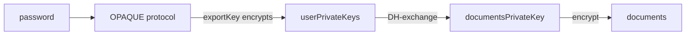

Steps for it to work

# Fastrun Playthrough

1. run `docker compose build && docker compose up`
2. Go to http://localhost:8080/ , login with account `admin` & password `changeme`
3. Go to clients, Import the provided `e2esamplefrontend.json` file
4. Click Roles. Create roles: `admin` and `user`
5. Go un Users, click admin, click Role mapping
6. Click Assign role. Click Filter, select "by clients"
7. Enable roles admin and user for the client e2esamplefrontend. Click `Assign`
8. Go to http://localhost:3000/
9. Set up a password such as `HELLO`. Keep it safe. Without your password, no way to gain access to the encrypted documents again
10. If you get a `BAD_STATUS` error, it means you did not get yourself the Admin role. Do it.
11. Normally, users need to be "activated" by an admin. However, on the first admin registration, this is done automatically. Just click refresh.
12. Enter the password again
13. Go to http://localhost:8080/, create a new user such as "bob" . Give it the user role, and a password
14. Start private navigation. Go to http://localhost:3000/, log as bob. Create a password in the app.
15. Activate bob's account with the admin.

# How does this work?

This project achieve zero-knowledge by having all data encrypted in the front-end.



1. [OPAQUE](https://datatracker.ietf.org/doc/draft-irtf-cfrg-opaque/) is used to generate a symmetric `exportKey` from a password. We arent doing [KDFs](https://en.wikipedia.org/wiki/Key_derivation_function) here to avoid brute-forcing the passwords. Opaque requires a server call which prevents that. Ideally, we should have OPAQUE identify not an user account, but one user device, but I won't do that for this project.
2. `exportKey` encrypts the user private keys. They are generated at registration time.
3. the user's private keys are used to do a [DH exchange](https://en.wikipedia.org/wiki/Diffie%E2%80%93Hellman_key_exchange) of keys between the admin who "activates" the user account, and the user. On the first admin registration, the documents's private keys are generated, and the admin transmits the keys to themselves
4. The user private keys are used to sign documents when they get uploaded. This allows conflict management (two users editing the same file at the same time), and allow tracking

So here, if an user forget their password, they would need to have their account removed. And they would need to recreate it, and have it activated again.
If all admins have forgot their password, well.. you can just wipe out all the data.

# Custom environment (including production)

## you need to know

1.  The base url for the backend ( by default: http://localhost:8000)
2.  The base url for the front-end ( by default: http://localhost:3000)
3.  The base url of your IAM (by default: http://localhost:8080 )

## Env variables to set

### Backend

| variable                 | doc                                                                              |
| ------------------------ | -------------------------------------------------------------------------------- |
| DOMAIN                   | Domain of the backend                                                            |
| BASE_URL                 | Base url to reach the endpoint, with the protocol                                |
| OPENID_CLIENT_ID         | Open id client identifier - you shouldnt change this                             |
| FRONTEND_ORIGIN          | Backend will only accept queries from within this origin                         |
| OPENID_ISSUER            | Public URL of the issuer, reachable from the browser                             |
| OPENID_ISSUER_FETCH_KEYS | URL to fetch the issuer keys. Can be different if using docker networks          |
| MONGODB_URL              | Url to a mongodb database to persist data. If not given, all will be kept in RAM |
| MONGODB_USERNAME         | An user for the mongodb                                                          |
| MONGODB_PASSWORD         | Password for said user                                                           |
| SERVER_SETUP             | OPAQUE server setup if you want to specify one                                   |

## Building everything

Run this:

```bash
docker compose build && docker compose up
```

## Setting up IAM

## Keycloak config file

Import the client with the file e2esamplefrontend.json provided
Be careful, you will still need to create the admin and user roles and map them

The default docker image use a pre-set admin user/password: admin and `changeme` as password.
It is not meant for production but for development

## Generic case

In your IAM:

- Make sure that the RS256 algorithm is used for open ID connect
- Leave client authentication off
- Create two roles: admin and user
- Map your users to admin/user ( admins will need to be in both groups)
